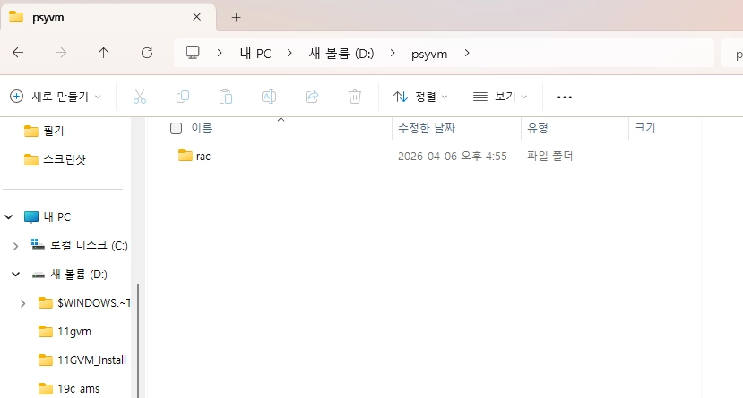
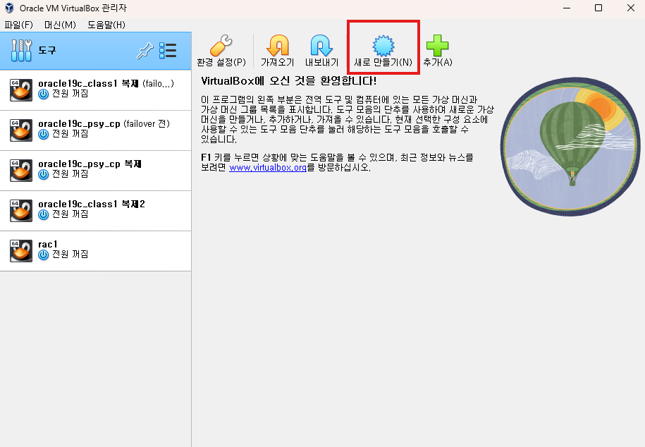
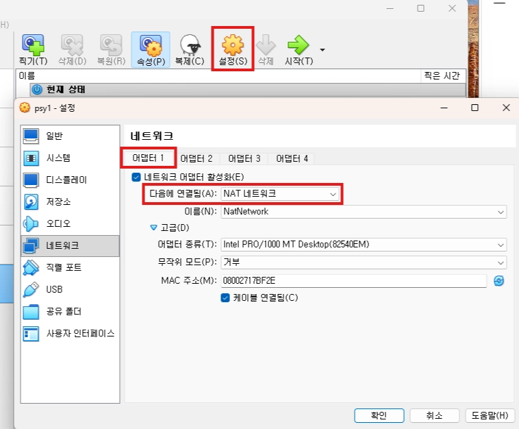

# vm 환경 구성

#### 이번 설치에서 사용할 주요 경로

| **이름** | **주소** |
| --- | --- |
| ORACLE_BASE | /u01/app/oracle |
| ORACLE_HOME | /u01/app/oracle/product/19c |
| GRID_HOME | /u01/app/grid/19c |

---

## 개념 정리

- **NAT vs NAT Network**
    - 단순 NAT는 VM 간 통신이 제한될 수 있어(RAC/GRID 구성 시) 문제가 생길 수 있음
    - **NAT Network**는 같은 NAT Network를 쓰는 VM끼리 통신이 가능
- **Host-Only Adapter**
    - 호스트(내 PC)와 VM 간 통신/관리용 네트워크로 많이 사용

---

### ☑️ 작업 절차

<aside>

1. VM(rac1) 생성(이름/OS/리소스/디스크)
2. VM 기본 설정(오디오 비활성화 등)
3. NAT Network 2개 생성(네트워크 관리자)
4. VM 네트워크 어댑터 구성
5. 규칙 점검(특히 rac1/rac2 어댑터1 NAT Network 이름 일치)
</aside>

---

## #0) 사전 준비 - 파일 생성

- rac 저장 폴더 미리 생성

## #1) VM(rac1) 생성

### 1-1) 새 VM 만들기

- 목적: rac1 VM 기본 골격 생성

#### 실행

- VirtualBox에서 새로 만들기 클릭

### 1-2) 이름/폴더/OS 타입 설정

- 목적: 노드 이름과 OS(64-bit)를 명확히 지정

#### 실행

- 이름: `psy1`
- 종류: Linux (64-bit)

→ 폴더 : 사전에 생성한 RAC 폴더로 지정

### 1-3) 메모리/CPU 설정

- 목적: GRID/DB 설치에 필요한 최소 리소스 확보

#### 실행

- 메모리: 8192MB
- CPU: 4 cores

### 1-4) 디스크 크기 설정 및 생성 완료

- 목적: OS/설치 파일 저장 공간 확보

#### 실행

- 디스크: 50GB

- 완료 클릭

---

## #2) VM 기본 설정 조정(리소스 최적화)

### 2-1) rac1 설정 진입

- 목적: 설치 전에 불필요 리소스/장치를 줄이고 네트워크를 설정할 준비
- 설정 → 시스템 → **부팅 순서 : 플로피 해제** → **포인팅 장치 : USB 태블릿**

### 2-2) 오디오 비활성화

- 목적: 리소스 확보(불필요 장치 제거)

---

## #3) NAT Network 생성(네트워크 관리자)

### 3-1) 네트워크 관리자 이동

- 목적: VM 간 통신이 가능한 NAT Network를 만들기 위함
- 파일 → 도구 → 네트워크 관리자

### 3-2) NAT 네트워크 생성(2개)

- 목적: rac1/rac2가 동일한 NAT Network를 선택하도록 준비
- NAT 네트워크 → 만들기 (2회 생성)

만들기 2번 클릭

<aside>
⚠️

가장 중요한 규칙

- **rac1의 어댑터 1**과 **rac2의 어댑터 1**이 **서로 같은 NAT Network 이름**을 선택해야 함
- 예: rac1이 `NatNetwork`면 rac2도 `NatNetwork`
- 예: rac1이 `NatNetwork1`면 rac2도 `NatNetwork1`
</aside>

---

## #4) VM 네트워크 어댑터 구성(rac1)

### 4-1) 어댑터 1: NAT Network

- 목적: VM 간 통신이 가능한 NAT 구성을 사용
- 주의: 단순 NAT는 게스트 간 통신이 막혀 GRID 설치 시 문제가 생길 수 있음

### 4-2) 어댑터 2: 호스트 전용 어댑터(Host-Only)

- 목적: 호스트 ↔ VM 관리/통신용 네트워크 구성

---

<aside>

**학습정리**

- 실습용 경로(ORACLE_BASE/HOME, GRID_HOME)를 정리했다.
- VirtualBox에서 rac1 VM을 생성하고(메모리/CPU/디스크), 오디오를 비활성화했다.
- NAT Network를 생성한 뒤, 어댑터1은 NAT Network, 어댑터2는 Host-Only로 구성했다.
</aside>